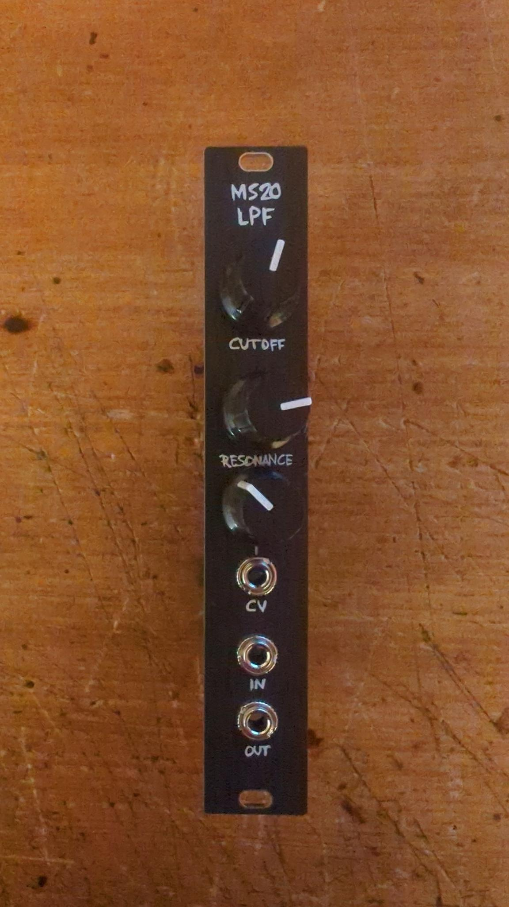
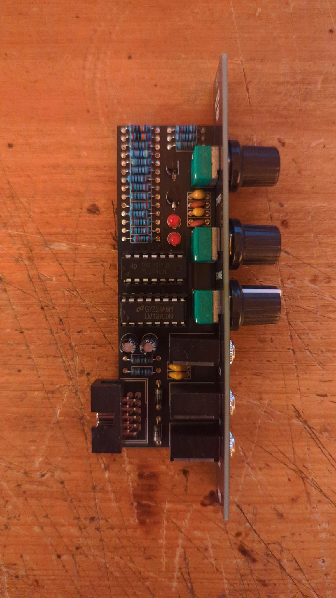

# ms20_lpf
This is a MS20 Low Pass Filter based on Renè Schmitz's design.
It is a Eurorack module that replicates the sound of the classic Korg MS-20 low pass filter.
I don't want to post the schematic here, but you can find it on [Renè Schmitz's website](https://schmitzbits.de/ms20.html).

## Build
- Order the PCBs from the PCB manufacturer of your choice.
- Order the components from your favorite electronics supplier.
- Solder the components to the PCB and mount the panel.

